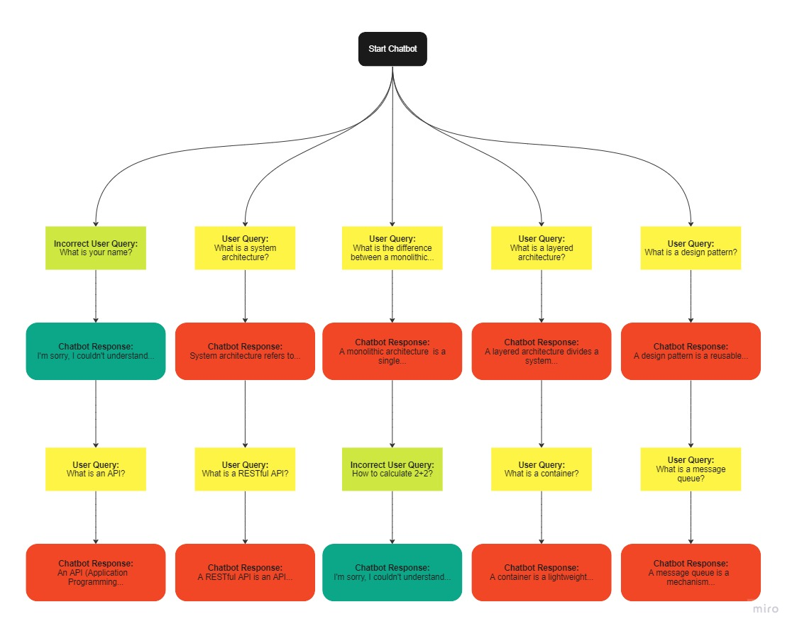

# AI Chatbot for System Design and Architecture

## Domain: System Design and Architecture

### Overview

Welcome to our AI-powered chatbot focused on system design and architecture! This chatbot is designed to provide information and answer questions related to various aspects of software system design and architecture. Whether you're looking to understand different architectural styles, design patterns, or deployment strategies, our chatbot is here to assist you.

You can find the full source code for this project on my [github](https://github.com/n-huzaifa/chatbot-next-app).

This Site is live at [system-architecture-chatbot.netlify.app](https://system-architecture-chatbot.netlify.app/) ✨✨

### Possible User Queries

1. "What is a software architecture?"
2. "What is a system architecture?"
3. "What is the difference between a monolithic and a microservices architecture?"
4. "What is a design pattern?"
5. "What is a layered architecture?"
6. "What is an event-driven architecture?"
7. "What is an API?"
8. "What is a RESTful API?"
9. "What is a service-oriented architecture?"
10. "What is a domain-driven design?"
11. "What is a component-based architecture?"
12. "What is a container?"
13. "What is a message queue?"
14. "What is an architecture style?"
15. "What is a data flow diagram?"
16. "What is a sequence diagram?"
17. "What is an architectural pattern?"
18. "What is a deployment diagram?"
19. "What is an architectural style?"
20. "What is scalability?"

### Conversational Flowchart



### Testing Results

During the testing phase, the chatbot performed well in providing accurate and relevant information regarding system design and architecture. Users found the chatbot's responses informative and helpful in gaining a better understanding of the concepts. The overall user experience was positive, with users appreciating the chatbot's ability to provide quick and reliable information.

### Areas for Future Improvement

While the chatbot has shown promising results, there are a few areas where further improvements can be made:

1. **Enhancing Natural Language Understanding**: By incorporating advanced NLP techniques, the chatbot can better understand complex user queries and provide more nuanced responses.

2. **Expanding Knowledge Base**: Continuously updating the chatbot's knowledge base with the latest advancements and trends in system design and architecture will ensure its relevance and usefulness over time.

3. **Integrating with External Resources**: Integrating the chatbot with external resources, such as online documentation and case studies, will provide users with additional references and real-world examples to enrich their learning experience.

4. **Improving User Interaction**: Implementing a more interactive and intuitive user interface can enhance the overall user experience and make the chatbot more engaging and user-friendly.

### Conclusion

In conclusion, our AI chatbot for system design and architecture has been successfully developed, offering valuable insights and information to users in an interactive and user-friendly manner. With further improvements and refinements, the chatbot has the potential to become an indispensable tool for individuals seeking knowledge in the field of system design and architecture.

```
Developed by Noor Ul Islam Huzaifa - 18680 - BSCS 6C
```
